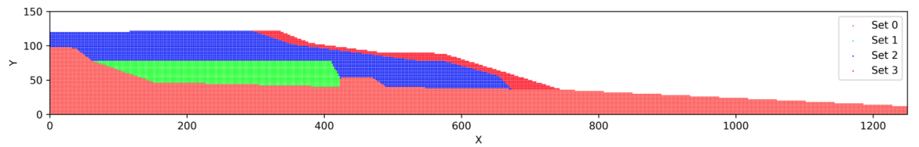

# Introduction

## Features
`cbgeopy` is a tool to generate material point method (MPM) model. The output model 
and associated files can be directly used as input files for [CB-geo MPM](https://github.com/cb-geo/mpm).

It supports the followings major features.

* Generate MPM models (background mesh and material points) for 2D and 3D space.
* Generate multi-layered material points for mountain-like topography (2D) from user-defined points that represents layer boundary line.


  
  


* Generate multi-layered material points for mountain-like topography (3D) from user-defined mesh file that represents layer boundary.* 


  
  


* Appending user-defined material point files (`.csv`) to the existing material points.
* Save material points as `.vtk` or `.html` files for visualization.  
* Generate CB-geo MPM input files wth user-defined constraints associated with the generated material points. The followings are
the CB-geo MPM specific files that the code can generate. 
  * `entity_sets.json`: defines cell group and particle group.
  * `mpm.json`: defines cell and particle group constraints and boundary conditions. Defines other CB-geo related simulation settings.
* Tools for post and preprocessing of CB-geo MPM.
* Tools for post and preprocessing of making GNS training data from CB-geo MPM.


## Usage
The following code shows an example for generating material point method model for simulating a rectangular cube drop 
due to gravity. More examples can be found in `./examples`. 

```python
import utils
from mpm import MPMConfig
import os
import math


save_dir = './'

# Set config
lx, ly, lz = 2.5, 0.3, 1.5
mpm = MPMConfig(domain_origin=[0, 0, 0], domain_length=[lx, ly, lz])

# Mesh
cell_size = 0.1
mpm.add_mesh(
    n_cells_per_dim=[math.ceil(lx/cell_size),
                     math.ceil(ly/cell_size),
                     math.ceil(lz/cell_size)])

# Add materials
mpm.add_materials(
    [
        {
            "id": 0,
            "density": 1800,
            "youngs_modulus": 1e7,
            "poisson_ratio": 0.2,
            "friction": 33.0,
            "dilation": 0.0,
            "cohesion": 100,
            "tension_cutoff": 50,
            "softening": False,
            "peak_pdstrain": 0.0,
            "residual_friction": 30.0,
            "residual_dilation": 0.0,
            "residual_cohesion": 0.0,
            "residual_pdstrain": 0.0,
            "type": "MohrCoulomb3D"
        }
    ]
)

# Particles
mpm.add_particles_cube(
    cube_origin=[0, 0, 0],
    cube_length=[1.0, 0.3, 1.2],
    material_id=0,
    n_particle_per_cell=4,
    particle_group_id=0
)
# Define particle entities for all particle sets added to `mpm` instance. 
# The id of the particle set will follow `particle_group_id` defined by `add_particles_cube` method. 
mpm.define_particle_entity()

# Boundary constraints
mpm.define_boundary_entity()
# Note that `define_boundary_entity` automatically assign node set id 0 to 5 to each boundary in 3d domain.
# So, if you want to assign additional node set id, you need to start from 6. 

mpm.add_velocity_constraints(
    [
        {"axis": "x", "bound_loc": "start", "velocity": 0.0},  # node set id 0 (hardcoded)
        {"axis": "x", "bound_loc": "end", "velocity": 0.0},  # node set id 1 (hardcoded)
        {"axis": "y", "bound_loc": "start", "velocity": 0.0},  # node set id 2 (hardcoded)
        {"axis": "y", "bound_loc": "end", "velocity": 0.0},  # node set id 3 (hardcoded)
        {"axis": "z", "bound_loc": "start", "velocity": 0.0},  # node set id 4 (hardcoded)
        {"axis": "z", "bound_loc": "end", "velocity": 0.0}  # node set id 5 (hardcoded)
    ]
)
mpm.add_friction_constrains(
    [
        {"axis": "x", "bound_loc": "start", "sign_n": -1, "friction": 0.4},
        {"axis": "x", "bound_loc": "end", "sign_n": 1, "friction": 0.4},
        # {"axis": "y", "bound_loc": "start", "sign_n": -1, "friction": 0},
        # {"axis": "y", "bound_loc": "end", "sign_n": 1, "friction": 0},
        {"axis": "z", "bound_loc": "start", "sign_n": -1, "friction": 0.4},
        {"axis": "z", "bound_loc": "end", "sign_n": 1, "friction": 0.4}
    ]
)

# If you want to add additional cell entity by defining another node set, you can do the following. 
# Note that nset_id should be larger than 5, since six boundaries already occupies nset_id 0 to 5. 
mpm.add_cell_entity(
    nset_id=6,
    ranges=[[1.0-0.01, 1.0+0.01],
            [0-0.01, 0.3+0.01],
            [0-0.01, 1.5+0.01]]
)

# External loading conditions
mpm.add_external_loadings(
    {"gravity": [0, 0, -9.81]}
)

# Analysis settings
mpm.analysis({
    "mpm_scheme": "usl",
    "locate_particles": False,
    "dt": 1e-06,
    "damping": {
        "type": "Cundall",
        "damping_factor": 0.05
    },
    "resume": {
        "resume": False,
        "step": 0,
        "uuid": "sand3d"
    },
    "velocity_update": False,
    "nsteps": int(1e6),
    "type": "MPMExplicit3D",
    "uuid": "sand3d"
})

# Post-processing
mpm.post_processing({
    "path": "results/",
    "output_steps": 5000,
    "vtk": [
        "displacements", "stresses"
    ]
})


mpm.write(save_dir=save_dir)

# mpm.visualize_mesh(save_path=f'{save_dir}/mesh_config.html', node_indices=True)
mpm.visualize_particles(save_path=f'{save_dir}/particle_config.html')

# Save the current script
# Get the path of the currently running script (main.py)
current_script_path = os.path.abspath(__file__)
utils.save_script(
    current_script_path,
    save_path=f'{save_dir}/input_script.py')
```

## Installation
```shell
# Initiate a python virtual environment.
python -m virtualenv venv
# Activate the virtual environment.
source venv/bin/activate
# Install dependencies.
python -m pip install --upgrade pip
pip install -r requirements.txt
```

## Note
To create parallel `.h5`, use [this code](https://github.com/kks32/mpm-csv-hdf5).

## TODO
- [ ] Improve 3D base mesh projection method.
