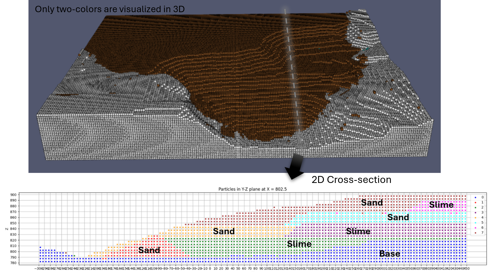
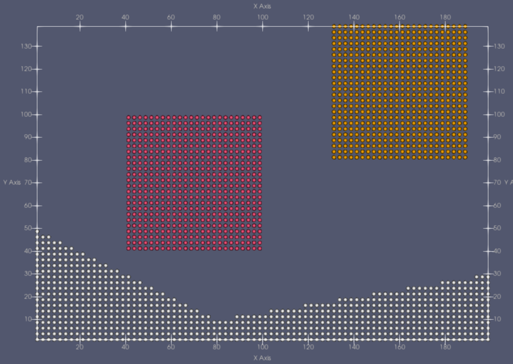

# Examples

## Make 3D topography model from mesh files

This example generates material point method model from external `mesh.obj` files which defines layer boundaries of
ground of mountain.



```{literalinclude} ../examples/fundao-3d/input_script.py
:language: python
```

## Make MP model based on 2D lines

This example generates material point method model from user-defined points defining the boundary lines that
distinguishes the layers. 


```{literalinclude} ../examples/fundao-2d/input_script.py
:language: python
```

## Make MP model for sand cube collision

This example generates material point method model from two colliding cubes. 
This saves 



```{literalinclude} ../examples/sand_layers-2d/input_script.py
:language: python
```

